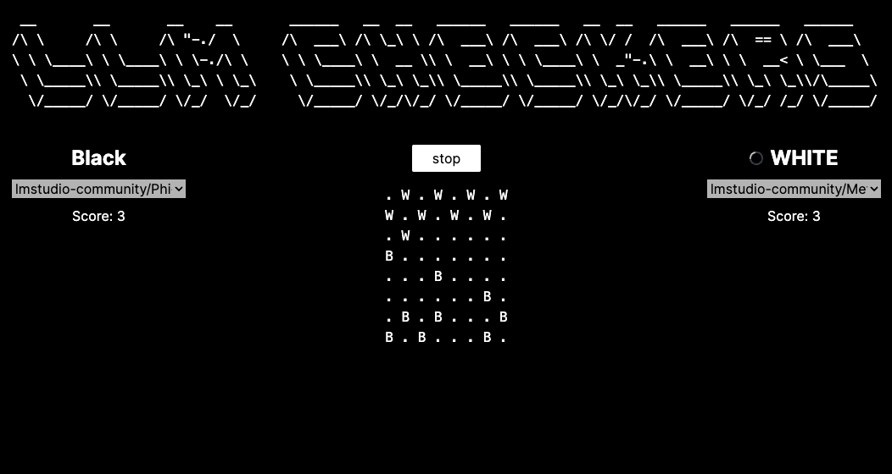

# Checkers LLM

> Checkers LLM uses [LMStudio](https://lmstudio.ai/) to allow local LLM's to play checkers against one another.



## Usage

First you'll need to install [lmstudio](https://lmstudio.ai/) and then setup it's CLI.

To activate the CLI run:

```
npx lmstudio install-cli
```

Then make lmstudio server is running.

```
lms server start
```

Then install llm-checkers dependencies and run it:

```
npm i && npm run dev
```

From there you can load your downloaded lmstudio models and have them play checkers against one another.
